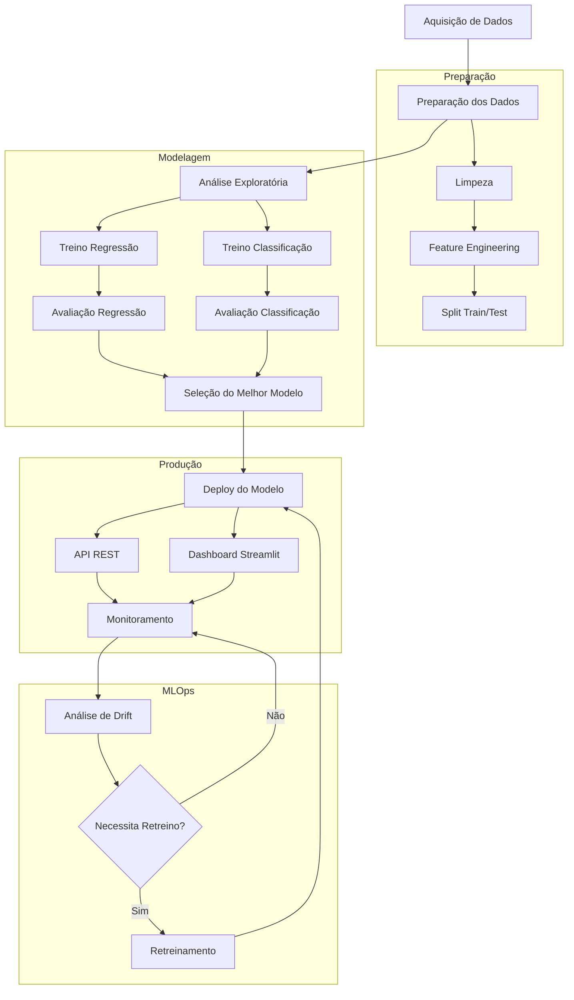

# Projeto de Ciência de Dados - Preditor de Arremessos do Kobe Bryant

## Visão Geral
Este projeto segue a estrutura do Team Data Science Process (TDSP) da Microsoft e tem como objetivo desenvolver um preditor de arremessos do Kobe Bryant ("Black Mamba") utilizando duas abordagens:

1. Regressão Linear - Para prever a probabilidade de acerto
2. Classificação - Para prever se o arremesso será convertido ou não

## Documentação do Projeto

A documentação completa do projeto está organizada na pasta `docs/` e inclui:

- [Project Charter](docs/ProjectCharter.md) - Visão geral do projeto, objetivos e escopo
- [Data Report](docs/DataReport.md) - Análise detalhada dos dados e suas características
- [Model Report](docs/ModelReport.md) - Documentação dos modelos desenvolvidos e suas performances
- [Data Split Strategy](docs/DataSplitStrategy.md) - Estratégia de divisão dos dados para treino e teste
- [Model Selection](docs/model_selection.md) - Critérios e processo de seleção do modelo final
- [Production Analysis](docs/production_analysis.md) - Análise de performance em produção
- [Retraining Strategy](docs/retraining_strategy.md) - Estratégia de retreinamento do modelo

## Diagrama do Pipeline



## Detalhamento das Etapas

### 1. Aquisição e Preparação
- Coleta dos dados históricos dos arremessos
- Limpeza e tratamento de dados ausentes
- Feature engineering
- Divisão treino/teste (80/20)

### 2. Modelagem
- Desenvolvimento paralelo de dois modelos:
  - Regressão Linear (probabilidade)
  - Classificação (decisão binária)
- Avaliação e comparação de performance
- Seleção do modelo final

### 3. Produção
- Deploy do modelo via API REST
- Interface Streamlit para visualização
- Sistema de logs e monitoramento
- Pipeline de retreinamento automático

### 4. MLOps
- Monitoramento contínuo de métricas
- Detecção de data drift
- Retreinamento automático quando necessário
- Versionamento de modelos com MLflow

## Ferramentas e Pipelines

### MLFlow
- **Rastreamento de Experimentos**
  - Registro automático de parâmetros, métricas e artefatos
  - Versionamento de modelos com tags e notas
  - Comparação visual entre diferentes experimentos
  - Organização por experimentos e runs

- **Monitoramento**
  - Métricas de performance em tempo real
  - Logs detalhados de execução
  - Visualização de resultados
  - Registro de dependências e ambiente

- **Atualização de Modelo**
  - Sistema de versionamento de modelos
  - Registro de linhagem dos modelos
  - Rollback facilitado
  - Transição suave entre versões

### PyCaret
- **Funções de Treinamento**
  - Preparação automática de dados
  - Seleção e comparação de modelos
  - Otimização automática de hiperparâmetros
  - Validação cruzada integrada

- **Pipeline de Modelagem**
  - Preprocessamento automático
  - Feature selection integrado
  - Ensemble de modelos
  - Interpretação de resultados

### Scikit-Learn
- **Pipeline de Modelagem**
  - Preprocessamento padronizado de dados
  - Feature engineering consistente
  - Validação cruzada estratificada
  - Métricas de avaliação

- **Funções de Treinamento**
  - Implementação dos algoritmos base
  - Otimização de hiperparâmetros (GridSearchCV)
  - Transformação de features
  - Avaliação de performance

### Streamlit
- **Interface e Deployment**
  - Dashboard interativo em tempo real
  - Visualização de métricas e resultados
  - Interface para novas predições
  - Monitoramento visual do modelo

- **Monitoramento da Saúde**
  - Visualização de drift em features
  - Acompanhamento de métricas
  - Alertas de performance
  - Análise de predições

### Integração das Ferramentas

1. **Pipeline de Desenvolvimento**
   ```mermaid
   graph LR
       A[Dados] --> B[PyCaret]
       B --> C[Scikit-Learn]
       B --> D[MLFlow]
       D --> E[Registro de Experimentos]
       C --> D
   ```

2. **Pipeline de Produção**
   ```mermaid
   graph LR
       A[MLFlow] --> B[Modelo em Produção]
       B --> C[Streamlit]
       B --> D[Monitoramento]
       D --> E[Análise de Drift]
       E --> F{Retreino}
       F -->|Sim| G[PyCaret]
       G --> A
   ```

### Benefícios da Integração

1. **Desenvolvimento Ágil**
   - PyCaret acelera a experimentação
   - Scikit-Learn garante robustez
   - MLFlow mantém rastreabilidade

2. **Produção Robusta**
   - Streamlit facilita visualização
   - MLFlow gerencia versões
   - Monitoramento automatizado

3. **Manutenção Simplificada**
   - Detecção automática de problemas
   - Retreinamento facilitado
   - Rollback rápido quando necessário

## Ferramentas Utilizadas
- MLFlow: Tracking de experimentos
- PyCaret: Desenvolvimento dos modelos
- Scikit-learn: Preprocessamento e avaliação
- Streamlit: Interface de usuário

## Como executar o projeto

Criei o projeto utilizando Anaconda e Python 3.9 (`conda create -n kobe_env python=3.9`)

```bash
conda activate kobe_env
pip install -r requirements.txt
make all
```

Caso queria executar passo-a-passo, execute os comandos abaixo na ordem descrita

```bash
make mlflow
make pipeline
make application
make streamlit
```